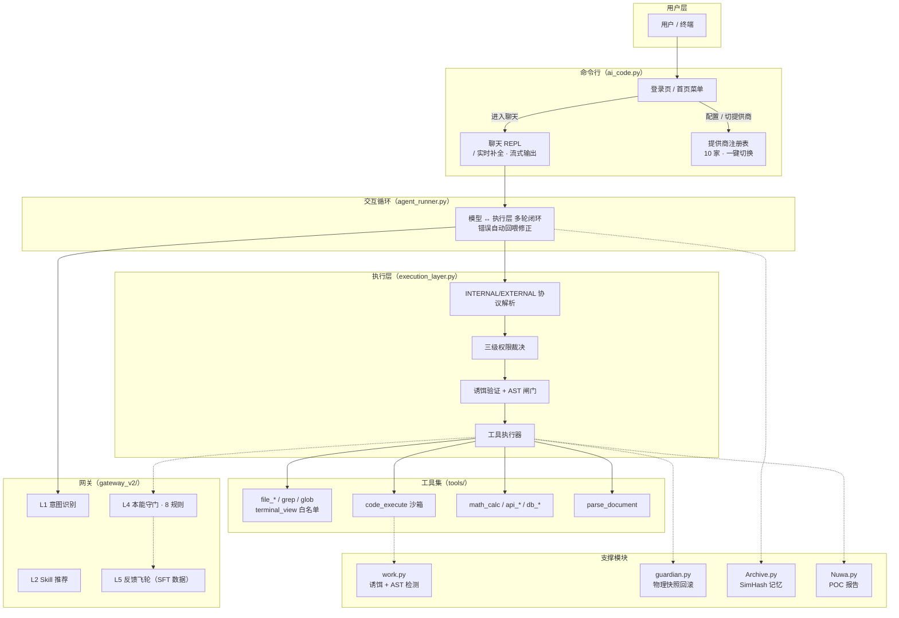

<h1 align="center">ACE · AI Code Engine</h1>

<p align="center">
  <strong>一个把安全下沉到执行层的 AI 编码 Agent —— 模型只负责理解和输出，<br>
  权限、沙箱、快照回滚全部由执行层裁决。</strong>
</p>

<p align="center">
  <a href="https://github.com/jincheng3870682453-hash/ace-agent/actions/workflows/ci.yml"></a>
  
  
  <a href="LICENSE"></a>
</p>

<p align="center">
  
</p>

<p align="center">
  <sub>上图是 <code>python ai_code.py --mock</code> 的真实会话录制（离线、无需密钥），
  用 <a href="demo/record_demo.py"><code>demo/record_demo.py</code></a> 可随时重录。</sub>
</p>

大多数 Agent 把安全交给提示词："请不要删除文件"。ACE 不这么做：模型的每一次工具调用都要穿过一个独立的执行层，由它做权限裁决、危险行为检测、写入前快照。提示词失效时，执行层仍然拦得住。

配套一个 Claude Code 风格的终端：登录页、`/` 实时补全、10 家模型提供商一键切换、流式输出。核心零第三方依赖。

## 目录

- [快速开始](#快速开始)
- [设计取向](#设计取向)
- [核心能力](#核心能力)
- [架构](#架构)
- [命令参考](#命令参考)
- [安全模型](#安全模型)
- [配置](#配置)
- [项目结构](#项目结构)
- [开发与测试](#开发与测试)
- [许可](#许可)
- [设计参考](#设计参考)

## 快速开始

**前置**：Python ≥ 3.10（用到 `int.bit_count`，建议 3.11/3.12）。核心不需要装任何第三方包。

```bash
git clone https://github.com/jincheng3870682453-hash/ace-agent.git
cd ace-agent
python test_all.py          # 端到端测试，纯 stdlib，应当全绿
```


不配密钥先看效果：

```bash
python ai_code.py --mock    # 离线演示，完整跑一遍 模型↔执行层 闭环
```

接真实模型：启动后在首页选 `2` 走配置向导（① 选提供商 → ② 隐藏输入 API Key → ③ 选模型），再选 `1` 进聊天。

```bash
python ai_code.py                    # 首页菜单
python ai_code.py --input "现在几点"  # 单次对话，跑完即退
```

Windows 上项目目录已带 `ace.cmd`，加入 PATH 后可在任意目录直接敲 `ace`。

<details>
<summary>其他启动方式（本地 Ollama / 原生 function calling / 容器）</summary>

```bash
ace --tools                     # 原生工具调用（OpenAI 兼容 function calling，不支持时自动降级到文本协议）
ace --max-history 12            # 只保留最近 12 轮，防止本地小模型上下文溢出
ace --install-ui                # 装 / 补全 prompt_toolkit（多镜像自动回退）

# 本地 Ollama（Qwen 支持原生工具调用）
python agent_runner.py --base-url http://localhost:11434/v1 --api-key ollama \
       --model qwen2.5-coder:7b --tools

# 容器：根目录 Dockerfile 是最小可跑镜像（默认 --mock）
docker compose up               # ACE + Ollama 编排
```

`docker/` 下另有 lite / standard / full 三档镜像与模型下载脚本，说明见 [`docker/README-Docker.md`](docker/README-Docker.md)。

</details>

## 设计取向

三条贯穿全项目的决定，先说清楚，免得你读代码时觉得奇怪：

**安全属于执行层，不属于提示词。** 权限裁决、危险命令拦截、写入前快照都在 `execution_layer.py` 里，与模型无关。换模型、模型被越狱、提示词被覆盖，这层都还在。

**默认只读。** 起步权限是 `readonly`，写工具会被 403 拦下。模型可以申请授权（`request_permission`），由用户选「本次」或「本会话」。`terminal_exec` 例外：它只接受逐次确认，因为它的危险命令黑名单本身可被绕过，「人看一眼命令」是它唯一有效的防线。

**边界要说清能挡什么、挡不住什么。** `code_execute` 是进程内策略层沙箱，不是 OS 级隔离；`terminal_exec` 的黑名单是止血层，不是完备边界。文档里不会把它们写成"安全"，生产部署的真实隔离手段见[安全模型](#安全模型)末尾。

## 核心能力

| 能力 | 说明 |
|---|---|
| 三级权限裁决 | `readonly` / `write` / `full`，工具与权限组在 `tools/registry.py` 单点声明，schema 与权限集合全部由它派生 |
| 写入前物理快照 | 每次写操作前自动快照，`/undo` 一键回滚；HMAC 签名防元信息伪造，快照目录自身不可被 Agent 改写 |
| Plan Mode | 复杂任务先提议分步计划（`plan_propose`），用户批准后才放行，杜绝"边想边干" |
| 行为检测闸门 | 诱饵验证（首次 `code_execute` 注入语义诱饵）+ AST 检测（6 规则：无限递归 / 硬编码密钥 / SQL 注入等） |
| 本地代码检索 | `grep` 正则搜内容 + `glob` 找文件 + `file_read` 分段读，只读权限下即可用，不必猜文件名 |
| 局部编辑 | `str_replace` 按片段替换：唯一匹配才写，多匹配报 409 让模型补上下文，缩进以文件真实缩进为准 |
| 10 家提供商 | 智谱 GLM / DeepSeek / Kimi / OpenAI / Claude / Qwen / 硅基流动 / OpenRouter / Ollama，`/provider` 一键切换 |
| 真实工具全家桶 | 联网搜索（双引擎兜底，无需 Key）、SQLite 读写、文档解析（Word/Excel/PPT/PDF/OCR）、浏览器、截图、通知、图像生成 |
| SimHash 记忆 | 主题切换时预注入相关历史，按会话隔离 |
| i18n | zh / en / ja，`@lang` 同时切换模型回复语言与界面语言 |

## 架构



| 层 | 组件 | 职责 |
|---|---|---|
| 用户层 | `ai_code.py` | 登录页、聊天 REPL、斜杠命令、提供商切换（纯终端，编辑器无关） |
| 交互循环 | `agent_runner.py` | 模型 ↔ 执行层多轮闭环；格式错误 / 守门 / 诱饵自动回喂修正，最多 20 轮 |
| 模型网关 | `gateway_v2/` | L1 意图 → L2 技能 → L4 守门（8 规则）→ L5 飞轮 |
| 执行层 | `execution_layer.py` | 协议解析、权限裁决、安全闸门、快照与守门串联 |
| 工具集 | `tools/` | `registry` 单点声明 + 按域拆分的执行器 |
| 支撑模块 | `work.py` `guardian.py` `Archive.py` `Nuwa.py` | 行为检测、快照回滚、记忆、报告 |

详细架构决策（为什么用 SimHash、为什么双层协议、为什么坚持零依赖）见 [`docs/ADR.md`](docs/ADR.md)。

## 命令参考

**首页**：↑/↓ 选择 · 数字直选 · Enter 确认 · Esc/q 退出。聊天内 `exit` 回首页，首页 `7`/`Esc`/`q` 才真正退出。

**斜杠命令**（聊天里输入 `/` 实时弹菜单，需 `prompt_toolkit`，未装自动降级）：

| 分类 | 命令 |
|---|---|
| 会话 | `/help` `/clear` `/status` `/stats` `/exit` |
| 安全 | `/permission [level]` `/snapshots` `/undo` `/rollback <id>` |
| 模型 | `/provider [名称\|编号] [key]` `/model <名称>` `/config` `/mock` |
| 工具 | `/open <路径>` `/edit <路径>` `/search <关键词>` `/memory` `/report` |

```bash
/provider                   # 列出 10 家提供商（当前标 ✓）
/provider zhipu             # 一键切智谱（自动换到 glm-4.7-flash）
/provider 3 sk-你的key      # 编号 + 密钥一把梭
```

**@ 快捷方式**（输入 `@` 弹菜单）：

| 命令 | 作用 | 示例 |
|---|---|---|
| `@lang` | 切换回复语言 + 界面语言（zh/en/ja） | `@lang en` |
| `@skill` | 切换技能，描述与推荐工具注入提示词 | `@skill coding` |
| `@file` | 把文件内容加入上下文（≤4000 字符自动截断） | `@file README.md` |
| `@folder` | 把文件夹列表加入上下文（≤30 项） | `@folder tools` |
| `@refs` / `@clear` | 查看 / 清空当前引用（最多保留 3 项） | `@refs` |

可选技能：`coding`（默认推荐 `code_execute` `file_write` `terminal_exec`）· `writing` · `analysis` · `fiction` · `general`。

**在对话里打开文件**——默认只给可点击链接，不抢焦点、不弹窗：

```
（自己动手）  ❯ /open 报告.docx        # 系统默认程序打开
              ❯ /edit main.py          # 优先 VS Code
（叫 Agent）  ❯ 帮我打开桌面的报告.docx
              🔗 点击打开文件: C:\Users\...\报告.docx   ← 点一下才展开
```

## 安全模型

配置优先级：命令行参数 > `~/.ai_code.json` > `~/.claude/settings.json` > 环境变量。

**权限与授权**

- 默认 `readonly`；写工具需显式 `/permission write` 或 `--permission write`
- 授权两档：「本次」用后即焚，「本会话」本会话内不再询问
- `terminal_exec` 强制逐次确认，不接受会话级授权
- 非交互模式（非 tty）下一切授权请求与计划审批都 fail-close 拒绝

**执行隔离**

- `terminal_view`：白名单只读命令，内建实现不经 shell，拦 shell 元字符，版本参数严格校验
- `code_execute`：AST 拦危险模块（os/subprocess/socket/pickle/importlib…）与内建逃逸链（`__builtins__`/`__class__`）、`open` 全禁 → 环境变量清洗 → 临时目录 + 30s 超时
- `math_calc`：白名单 AST 求值，仅纯算术，幂运算限 100^1000，杜绝 eval 逃逸与指数 DoS

**路径边界**

- 文件工具默认限制在项目目录内（`confine_files`，含跨盘符检查）；`grep`/`glob` 无条件限项目内，只读检索也不放开项目外
- 读越界按"泄露什么"分档：**读文件内容一律限项目内**（`cat`/`type`、外部命令路径参数、`file_read` 均 403）；**列目录名单允许越界**（`ls`/`dir`）。前者泄露的是凭据本身，后者只是文件名
- 敏感目标硬拦截：绝对路径写入放行（"放到桌面"）但不含凭据与自启动入口（`~/.ssh`、`~/.bashrc`、`~/.ai_code.json`、`.pem`/`.key` 等）

**回滚与网络**

- 写入前自动快照，快照元信息可用 `signing_key` 做 HMAC-SHA256 签名；快照数量有硬上限，自动清理最旧
- `.guardian/` 快照目录对所有工具只读且不可写删——它就在 Agent 可写的项目目录里，不挡住的话改一行 `meta.json` 就能让熔断回滚静默失效；回滚失败会告警而不是静默吞掉
- 守门分层：block 级拦截并回滚本轮快照，warn 级不阻断；只回滚本轮，不动无关修改
- `api_get`/`api_post` 仅 http/https，且 **DNS 解析后**拦截内网 / 回环 / 链路本地地址（防 SSRF）；未实现的工具返回 501 而非假成功

> **生产部署必读**：`code_execute` 与 `terminal_exec` 是进程内策略层沙箱，**不是 OS 级隔离**。沙箱黑名单与高危命令筛查都只是止血层，`python -c` 一类等价路径无法靠枚举封死。生产环境必须配合：容器 / 虚拟机 + 低权限账户运行、按需授权而非常开 `write`、`signing_key` 置于项目目录之外。

## 配置

```python
config = {
    "flywheel_path": ".../violations.jsonl",   # L5 飞轮落盘路径
    "sandbox_base": "...",                     # code_execute 沙箱临时目录（默认系统临时区）
    "confine_files": True,                     # 文件工具限制在项目目录内（含跨盘符检查）
    "signing_key": "你的签名密钥",              # Guardian 快照 HMAC 签名（生产建议）
    "max_snapshots": 20,                       # 快照硬上限，自动清理最旧
    "session_id": "会话标识",                   # Archive 记忆按会话隔离
    "bait": {"enabled": True, "frequency": 0}, # 诱饵验证（0 = 每任务一次）
    "guard": {"rules": {"no_hardcoded_secrets": False}},  # 关闭某条守门规则
    "email_smtp": {"host": "smtp.qq.com", "port": 587,
                   "user": "you@qq.com", "password": "授权码",
                   "use_tls": True},           # notify_send email 渠道（缺省时返回 501）
}
```

## 项目结构

```
ace-agent/
├── ai_code.py                  # 命令行前端：登录页 / REPL / 斜杠补全 / 提供商注册表
├── agent_runner.py             # 交互循环：模型 ↔ 执行层多轮闭环，错误自动回喂
├── execution_layer.py          # 执行层主入口：协议解析、权限、安全闸门、Plan Mode
├── tools/                      # 工具执行器包
│   ├── registry.py             #   工具唯一声明处（name / schema / 权限组 / handler）
│   ├── base.py                 #   共享助手 + 敏感目标判定 + execute 分发
│   └── {file,code,web,db,notify,parse}_tools.py
├── gateway_v2/                 # 网关包：intent(L1/L2) · guard(L4) · flywheel(L5)
├── work.py                     # 诱饵工厂 + ASTDetector + BehaviorConstraint
├── guardian.py                 # 物理快照回滚：快照 / 完整性预检 / HMAC / 自动清理
├── Archive.py                  # SimHash 记忆引擎
├── Nuwa.py                     # POC 报告（HTML + JSON）
├── universal_document_parser.py# N 合一文档解析 + 懒加载 + 50MB 防线
├── i18n.py + locales/          # 轻量国际化（zh / en / ja JSON 字典）
├── prompts/                    # 系统提示词：v7 完整版 · v8 精简版 · tools 原生调用版
├── test_all.py                 # 全模块端到端测试（纯 stdlib）
├── demo/                       # README 演示动画 + 录制脚本（跑真实 --mock 会话）
├── docs/ADR.md                 # 架构决策记录

├── LICENSE                     # MIT
├── docker/                     # lite / standard / full 三档镜像 + 模型下载脚本
└── .github/workflows/ci.yml    # CI：Python 3.10/3.11/3.12 编译检查 + 全量测试 + ruff
```

## 开发与测试

```bash
python test_all.py                          # 全量测试，退出码非 0 即失败
ruff check . --select E9,F63,F7,F82         # CI 用的同一套硬错误检查
python demo/record_demo.py                  # 重录 README 顶部的演示动画
python demo/record_demo.py --check          # 只校验动画是否还和当前输出一致
```

测试是单文件、纯 stdlib、无框架的端到端断言，`check(名称, 条件, 详情)` 逐条打印。用例总数随平台浮动（Windows 上 357 项，Linux 上 346 项——差额是 Windows 专有的路径/编码用例），所以这里不写死一个数字。CI 在 Python 3.10 / 3.11 / 3.12 三个版本上跑编译检查 + 全量测试 + ruff。


改动前请读 [`CONTRIBUTING.md`](CONTRIBUTING.md)（环境 / 测试 / 风格 / 提交流程）。改了行为的话，把断言旧行为的用例一起改掉——不要只加新用例。

Windows 提示：控制台 GBK 已做 UTF-8 兜底，但建议全局设 `PYTHONUTF8=1`。文档解析的增强依赖（python-docx / openpyxl / pdfplumber / pymupdf / pytesseract）按需装，见 `requirements.txt`；旧版 Office 格式（.doc/.xls/.ppt/.wps/.et）回退依赖系统级 LibreOffice 或 antiword。

## 许可

[MIT](LICENSE) © 2026 jincheng3870682453-hash

## 设计参考

架构决策与以下工作对齐——**让模型只负责"理解、选择、输出"，把权限、安全、回滚、记忆全部下沉到执行层**：

- [Agent Harness 工程最佳实践](https://github.com/Delphoa/study-awesome-harness-engineering)（工具 / 权限 / 记忆 / 沙箱 / 可观测性）
- [DeepSeek Harness 设计解析](https://developer.aliyun.com/article/1756780)
- [20 章中文 AI Agent 架构实战](https://github.com/ryzqi/learn-agent)
