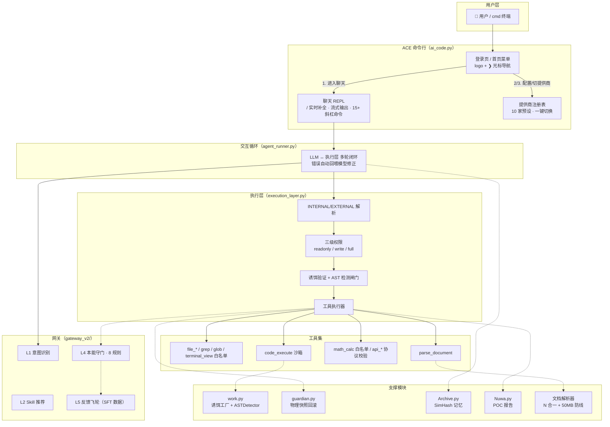

# ACE · AI Code Engine

> **沙盒 AI Agent 执行层 + Claude Code 风格命令行终端**
> 把「AI 只管执行，安全交给执行层」的哲学落地成一套可上线的工程：意图/守门/飞轮网关、诱饵验证、AST 熔断、物理快照回滚、SimHash 记忆、POC 报告，外加一个带登录页、斜杠补全、一键切提供商的全功能终端。

| 状态 | 版本 | 测试 |
|---|---|---|
| ✅ 可运行 | v1.1 | **199 项端到端测试全绿**（`test_all.py`，纯 stdlib） |

---

## 特性一览

- 🏠 **登录页/首页**：AI-CLI 启动平台同款主菜单 —— ASCII logo + `❯` 光标，↑/↓ 选择 · 数字直选 · Enter 确认 · Esc/q 退出；首次使用引导配置向导
- 💬 **聊天 REPL**：`/` 实时补全菜单（Claude Code 同款）、流式输出、工具耗时与"已自动快照"提示；**◈ 状态行实时反馈"思考中…/正在调用工具…"，内部推理（INTERNAL）不泄漏给用户**
- 🔀 **10 家提供商注册表**：`/provider` 一键切换（智谱 GLM-4.7-Flash / DeepSeek / Kimi / OpenAI / Claude / Qwen / 硅基 / OpenRouter / Ollama），`/config` 三步向导（选提供商 → 隐藏输入 key → 选模型）
- 🔄 **mock 双向切换**：`/mock` 随时在离线演示与真实模型间切换
- 🛡️ **无感安全**：写入前自动快照（上限自动清理）、`/undo` 一键回滚、快照 HMAC 签名、路径越界防护、SSRF 防护、`math_calc` 白名单
- 📋 **Plan Mode 计划执行**：复杂任务先提议分步计划（`plan_propose`），用户批准后才放行执行，杜绝"边想边干"
- 🔑 **权限申请**：工具被 403 拦截时模型可申请临时授权（`request_permission`），用户一键批准/拒绝，授权仅一次有效
- 🧠 **记忆与报告**：SimHash 主题切换记忆预注入（模型生成前注入，多会话隔离）、Nuwa POC 报告（HTML+JSON）
- ✂️ **局部编辑**：`str_replace` 按片段替换（唯一匹配才写、匹配失败不落盘、返回 unified diff）。多匹配报 409 让模型补上下文重试，`replace_all=true` 才全量替换；tab/空格与整块缩进偏移自动容错，写入时以文件真实缩进为准，不会把模型的错误缩进带进文件
- 🔎 **本地代码检索**：`grep`（正则搜内容，原生实现不经 shell，限项目内）+ `glob`（通配符找文件）+ `file_read` 的 `offset/limit` 分段读（返回带行号片段）——只读权限下即可用，不必猜文件名

- 🧩 **工具注册表**：`tools/registry.py` 单点声明 name / schema / 权限组 / handler，function calling schema 与三级权限集合全部由它派生；也是 MCP 的接入点
- 🔍 **真实联网能力**：`search` 工具真实搜索（DuckDuckGo → Bing 双引擎兜底，无需 API Key）；CLI `/search <关键词>` 直接验证；`api_get` 抓取网页正文

- 🗄️ **真实工具全家桶**：SQLite 数据库（db_query 只读/db_write 受控写入）、真实打开浏览器（browser_open）、屏幕截图（browser_screenshot，可选 pillow）、通知（notify_send：console/file/toast）、免费图像生成（image_generate，pollinations.ai）
- 📄 **文档解析**：N 合一（Word/Excel/PPT/PDF/OCR/纯文本）+ 50MB 大文件防线
- 🚪 **层层退出**：聊天内 exit 回首页，首页 7/Esc/q 才真正退出

---

## 架构图



**分层说明**：

| 层 | 组件 | 职责 |
|---|---|---|
| 用户层 | `ai_code.py` | 登录页、聊天 REPL、斜杠命令、提供商切换（纯终端，编辑器无关） |
| 交互循环 | `agent_runner.py` | LLM ↔ 执行层多轮闭环；格式错误/守门/诱饵自动回喂模型修正，最多 20 轮 |
| 模型网关 | `gateway_v2/` | L1 意图 → L2 技能 → L4 守门（8 规则）→ L5 飞轮（包结构分层） |
| 执行层 | `execution_layer.py` | 协议解析、三级权限裁决、诱饵/AST 闸门、工具执行、快照与守门串联 |
| 支撑模块 | `work.py` / `guardian.py` / `Archive.py` / `Nuwa.py` / 解析器 | 行为检测、快照回滚、记忆、报告、文档解析 |

---

## 模块清单

| 文件 | 职责 | 状态 |
|---|---|---|
| `ai_code.py` | ACE 命令行：登录页 / REPL / 斜杠补全 / 提供商注册表 / 配置向导 | ✅ |
| `agent_runner.py` | 交互循环：LLM ↔ 执行层多轮闭环，错误自动回喂 | ✅ |
| `execution_layer.py` | 执行层主入口：协议解析、权限、安全闸门、Plan Mode、权限申请（工具执行已拆到 `tools/`） | ✅ |
| `tools/` | 工具执行器包：`registry`（工具唯一声明处）/ `file_tools` / `code_tools` / `web_tools` / `db_tools` / `notify_tools` / `parse_tools` | ✅ |

| `gateway_v2/` | 网关包：`intent.py`（L1/L2）· `guard.py`（L4）· `flywheel.py`（L5） | ✅ |
| `work.py` | 诱饵工厂（5 种语义诱饵）+ ASTDetector（6 规则）+ BehaviorConstraint | ✅ |
| `guardian.py` | 物理快照回滚：自动快照、完整性预检、HMAC 签名、自动清理 | ✅ |
| `Archive.py` | SimHash 记忆引擎：主题切换、短输入保护、催促加权、会话隔离 | ✅ |
| `Nuwa.py` | POC 报告：通过率/平均响应/回滚计数，HTML + JSON | ✅ |
| `universal_document_parser.py` | N 合一文档解析 + 懒加载 + 截断 + 50MB 防线 | ✅ |
| `agent_system_prompt_v8.md` | Agent 系统提示词精简版（INTERNAL/EXTERNAL 协议） | ✅ |
| `agent_system_prompt_tools.md` | 原生工具调用版提示词（`--tools` 模式） | ✅ |
| `test_all.py` | 全模块端到端测试（326 项，纯 stdlib） | ✅ |


| `i18n.py` + `locales/` | 轻量国际化：zh/en/ja JSON 字典，`@lang` 同步切换界面语言 | ✅ |
| `docs/ADR.md` | 架构决策记录（SimHash/诱饵频率/双层协议/零依赖/Plan Mode） | ✅ |
| `CONTRIBUTING.md` | 贡献指南（环境/测试/风格/提交流程） | ✅ |
| `Dockerfile` + `docker-compose.yml` | 容器化：ACE + Ollama 一键编排 | ✅ |

---

## 快速开始

```bash
# 跑全部测试
python test_all.py

# ACE 命令行（项目目录内已提供 ace.cmd；加入 PATH 后可在任意目录直接 ace）
ace                             # 首页菜单：1 进入聊天 · 2 配置向导 · 4 离线演示 ...
ace --mock                      # 直接进聊天（离线演示，无需密钥）
ace --input "现在几点了"         # 单次对话
ace --tools                     # 原生工具调用（OpenAI 兼容 function calling，不支持时自动降级）
ace --max-history 12            # 只保留最近 12 轮对话，防止本地小模型上下文溢出
python agent_runner.py --base-url http://localhost:11434/v1 --api-key ollama \
      --model Qwen2.5-coder:7b --tools   # 接入本地 Ollama，Qwen 支持原生工具调用
ace --install-ui                # 一键安装 / 实时补全依赖（多镜像自动回退）
```

**首次使用**：首页选 `2` 配置向导（① 选提供商 → ② 隐藏输入 API Key → ③ 选模型），然后选 `1` 进入聊天。

---

## 交互速查

- **首页**：↑/↓ 选择 · 数字直选 · Enter 确认 · Esc/q 退出
- **聊天**：输入 `/` 实时弹出命令菜单（需 `prompt_toolkit`，未装自动降级）
- **斜杠命令**：`/help` `/clear` `/status` `/stats` `/memory` `/snapshots` `/undo` `/rollback <id>` `/report` `/permission [level]` `/mock` `/model` `/provider` `/config` `/open <路径>` `/edit <路径>` `/search <关键词>` `/exit`
- **@ 快捷方式**：`@lang en` 切换回复语言（zh/en/ja）· `@skill coding` 切换技能（coding/writing/analysis/fiction/general）· `@file <路径>` / `@folder <路径>` 把文件/文件夹内容加入上下文 · 输入 `@` 查看全部
- **退出**：聊天内 `exit` → 回首页；首页 `7`/`Esc`/`q` → 退出 ACE

**切换提供商 / 模型**：

```
/provider                       # 列出 10 家提供商（当前标 ✓）
/provider zhipu                 # 一键切智谱（自动换到 glm-4.7-flash）
/provider 3 sk-你的key          # 编号 + 密钥一把梭
/model glm-4.6                  # 换模型
/config                         # 三步向导
```

**内置提供商**：智谱 GLM（Anthropic/OpenAI 双端点，含免费开源的 **glm-4.7-flash**）、DeepSeek、Kimi/Moonshot、OpenAI、Anthropic Claude、通义 Qwen、硅基流动、OpenRouter、Ollama 本地。

## @ 快捷方式（语言 / 技能 / 文件引用）

聊天输入框里输入 `@` 弹出快捷方式菜单（装了 `prompt_toolkit` 时实时补全：`@la` → `@lang`，`@file ` 后可直接补全路径）：

| 命令 | 作用 | 示例 |
|------|------|------|
| `@lang` | 切换回复语言，指令注入每轮提示词 | `@lang en` |
| `@skill` | 切换技能，描述与推荐工具注入提示词 | `@skill coding` |
| `@file` | 把文件内容加入上下文（≤4000 字符自动截断） | `@file README.md` |
| `@folder` | 把文件夹文件列表加入上下文（≤30 项） | `@folder src` |
| `@refs` | 查看当前已引用的文件/文件夹 | `@refs` |
| `@clear` | 清空全部引用 | `@clear` |

支持的语言：`zh` 中文 · `en` English · `ja` 日本語。`@lang` 会同时切换模型回复语言与 CLI 界面语言（横幅、菜单、帮助、状态行等；配置向导等长尾输出仍为中文，见 `locales/`）。

支持的技能：

| 技能 | 说明 | 推荐工具 |
|------|------|----------|
| `coding` | 编程开发：写码/改码/调试 | `code_execute` `file_write` `terminal_exec` `search` |
| `writing` | 文案写作：写作/润色/报告 | `file_write` `search` `notify_send` `parse_document` |
| `analysis` | 数据分析：统计/报表 | `db_query` `math_calc` `parse_document` `search` |
| `fiction` | 小说创作：故事/角色/剧情 | `file_write` `search` `file_read` |
| `general` | 通用助手（默认） | `search` `file_read` `datetime_now` |

说明：
- 引用最多保留 3 项，`/clear` 与 `@clear` 都会清空；`/status` 可查看当前语言、技能与引用数。
- `@file`/`@folder` 支持相对项目目录或绝对路径，引用内容随每轮对话注入模型上下文。

**在对话里打开文件（点击才展开：默认给可点击链接，不抢焦点不弹窗）**：
```
（自己动手）❯ /open 报告.docx        # 系统默认程序打开
             ❯ /edit main.py          # 优先 VS Code
（叫 Agent 干）❯ 帮我打开桌面的报告.docx   # Agent 调 open_file → 对话里出现可点击链接
             🔗 点击打开文件: C:\Users\...\报告.docx   ← 点一下才全屏展开
（看产物）   截图/生成图片也以可点击链接形式收起展示，点击后全屏查看
```

配置优先级：命令行参数 > `~/.ai_code.json` > `~/.claude/settings.json`（本机已有模型配置）> 环境变量。API 格式自动识别：`/anthropic` 端点走 Anthropic Messages，其余走 OpenAI 兼容。

---

## 安全设计（多轮独立审查后加固）

- `terminal_view` 白名单只读命令（内建实现 + 元字符拦截 + 版本参数严格校验），readonly 不再能执行任意 shell
- `code_execute` 策略层沙箱：AST 拦截危险模块（os/subprocess/socket/pickle/importlib...）、内建逃逸链（`__builtins__`/`__class__`）、open 全禁 → 环境变量清洗 → 临时目录 + 30s 超时
- `math_calc` 白名单 AST 求值：仅纯算术，幂运算限 100^1000，杜绝 eval 逃逸与指数 DoS
- 路径穿越防护：文件工具与 ls/cat 默认限制在项目目录内（`confine_files`，含跨盘符检查）；`grep`/`glob` 无条件限制在项目目录内（只读检索不放开项目外，避免全盘扫凭据）

- `api_get/api_post` 仅 http/https，且 **DNS 解析后拦截内网/回环/链路本地地址**（防 SSRF）；未实现工具返回 501 而非假成功
- 快照 HMAC-SHA256 签名（`signing_key`）防元信息伪造；快照上限自动清理防备份爆炸
- 诱饵验证循环：首次 code_execute 自动注入语义诱饵 → 修复后重提；按任务隔离
- AST 熔断：未用导入/类型注解/无限递归/循环引用/硬编码密钥/SQL 注入（收敛为真实注入模式，不误伤正常递归）
- 守门分层：block 级拦截并回滚本轮快照；warn 级不阻断；读文件/最终回复只过文本规则
- 临时授权单次有效（用后即焚）；回滚仅回滚本轮快照
- 敏感目标拦截：绝对路径写入放行（"放到桌面"）但不含凭据与自启动入口（`~/.ssh`、`~/.bashrc`、`~/.ai_code.json` 等）；`terminal_view` 也禁读这些文件
- 默认权限为 `readonly`，写工具需显式 `/permission write` 或 `--permission write` 开启

> ⚠️ 生产部署注意：`code_execute`/`terminal_exec` 是进程内策略层沙箱，非 OS 级隔离——沙箱模块黑名单与终端高危命令筛查都只是止血层，`python -c` 一类等价路径无法靠枚举封死。生产环境必须配合：容器/虚拟机 + 低权限账户运行、按需授权而非常开 write、`signing_key` 置于项目目录之外。

---

## 配置项

```python
config = {
    "flywheel_path": ".../violations.jsonl",   # L5 飞轮落盘路径
    "sandbox_base": "...",                     # code_execute 沙箱临时目录（默认系统临时区）
    "confine_files": True,                     # 文件工具限制在项目目录内（含跨盘符检查）
    "signing_key": "你的签名密钥",              # Guardian 快照 HMAC 签名（生产建议）
    "max_snapshots": 20,                       # 快照硬上限，自动清理最旧
    "session_id": "会话标识",                   # Archive 记忆按会话隔离
    "bait": {"enabled": True, "frequency": 0}, # 诱饵验证（0 = 每任务一次）
    "guard": {"rules": {"no_hardcoded_secrets": False}},  # 关闭某条守门规则
    "email_smtp": {"host": "smtp.qq.com", "port": 587,
                   "user": "you@qq.com", "password": "授权码",
                   "use_tls": True},   # notify_send email 渠道（缺省时返回 501）
}
```

---

## 运行环境

- **Python ≥ 3.10**（`int.bit_count`；建议 3.11/3.12）
- 核心零第三方依赖；真实模型需 `requests`；`/` 实时补全需 `prompt_toolkit`（可选，`ace --install-ui` 一键装）
- 文档解析增强按需安装：见 `requirements.txt`（python-docx / openpyxl / pdfplumber / pymupdf / pytesseract 等）
- 旧版 Office 格式（.doc/.xls/.ppt/.wps/.et）回退依赖系统级 LibreOffice / antiword
- Windows GBK 控制台已做 UTF-8 兜底；建议全局 `PYTHONUTF8=1`

---

## 设计参考

架构决策与 [Agent Harness 工程最佳实践](https://github.com/Delphoa/study-awesome-harness-engineering)（工具/权限/记忆/沙箱/可观测性）、[DeepSeek Harness 设计解析](https://developer.aliyun.com/article/1756780)、[20 章中文 AI Agent 架构实战](https://github.com/ryzqi/learn-agent) 对齐：**让模型只负责"理解、选择、输出"，把权限、安全、回滚、记忆全部下沉到执行层**。
