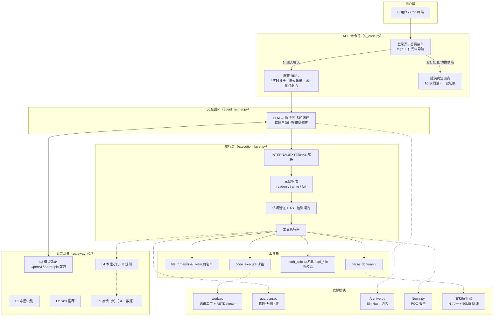

# ACE · AI Code Engine

> **沙盒 AI Agent 执行层 + Claude Code 风格命令行终端**
> 把「AI 只管执行，安全交给执行层」的哲学落地成一套可上线的工程：五层网关、诱饵验证、AST 熔断、物理快照回滚、SimHash 记忆、POC 报告，外加一个带登录页、斜杠补全、一键切提供商的全功能终端。

| 状态 | 版本 | 测试 |
|---|---|---|
| ✅ 可运行 | v1.1 | **1428 项端到端测试全绿**（`test_all.py`，纯 stdlib） |

---

## 特性一览

- 🏠 **登录页/首页**：AI-CLI 启动平台同款主菜单 —— ASCII logo + `❯` 光标，↑/↓ 选择 · 数字直选 · Enter 确认 · Esc/q 退出；首次使用引导配置向导
- 💬 **聊天 REPL**：`/` 实时补全菜单（Claude Code 同款）、流式输出、工具耗时与"已自动快照"提示；**◈ 状态行实时反馈"思考中…/正在调用工具…"，内部推理（INTERNAL）不泄漏给用户**
- 🔀 **10 家提供商注册表**：`/provider` 一键切换（智谱 GLM-4.7-Flash / DeepSeek / Kimi / OpenAI / Claude / Qwen / 硅基 / OpenRouter / Ollama），`/config` 三步向导（选提供商 → 隐藏输入 key → 选模型）
- 🔄 **mock 双向切换**：`/mock` 随时在离线演示与真实模型间切换
- 🛡️ **无感安全**：写入前自动快照（上限自动清理）、`/undo` 一键回滚、快照 HMAC 签名、路径越界防护、SSRF 防护（全记录校验 + pin-to-IP + 逐跳复检重定向）、`math_calc` 白名单 AST 求值（无 `eval`）
- 📋 **Plan Mode 计划执行**：复杂任务先提议分步计划（`plan_propose`），用户批准后才放行执行，杜绝"边想边干"
- 🔑 **权限申请**：工具被 403 拦截时模型可申请临时授权（`request_permission`），用户一键批准/拒绝，授权仅一次有效
- 🧠 **记忆与报告**：SimHash 主题切换记忆预注入（模型生成前注入，多会话隔离）、Nuwa POC 报告（HTML+JSON）
- 🔍 **真实联网能力**：`search` 工具真实搜索（DuckDuckGo → Bing 双引擎兜底，无需 API Key）；CLI `/search <关键词>` 直接验证；`api_get` 抓取网页正文
- 🗄️ **真实工具全家桶**：SQLite 数据库（db_query 只读/db_write 受控写入）、真实打开浏览器（browser_open）、屏幕截图（browser_screenshot，可选 pillow，**每次抓屏需确认**）、通知（notify_send：console/file/toast/email，**email 需确认**）、免费图像生成（image_generate，pollinations.ai）
- 📄 **文档解析**：N 合一（Word/Excel/PPT/PDF/OCR/纯文本）+ 50MB 大文件防线
- 🚪 **层层退出**：聊天内 exit 回首页，首页 7/Esc/q 才真正退出

---

## 架构图



**分层说明**：

| 层 | 组件 | 职责 |
|---|---|---|
| 用户层 | `ai_code.py` | 登录页、聊天 REPL、斜杠命令、提供商切换（纯终端，编辑器无关） |
| 交互循环 | `agent_runner.py` | LLM ↔ 执行层多轮闭环；格式错误/守门/诱饵自动回喂模型修正，最多 20 轮 |
| 模型网关 | `gateway_v2/` | L1 意图 → L2 技能 → L3 模型（OpenAI/Anthropic 双协议）→ L4 守门（8 规则）→ L5 飞轮（包结构分层） |
| 执行层 | `execution_layer.py` | 协议解析、三级权限裁决、诱饵/AST 闸门、工具执行、快照与守门串联 |
| 支撑模块 | `work.py` / `guardian.py` / `Archive.py` / `Nuwa.py` / 解析器 | 行为检测、快照回滚、记忆、报告、文档解析 |

---

## 模块清单

| 文件 | 职责 | 状态 |
|---|---|---|
| `ai_code.py` | ACE 命令行：登录页 / REPL / 斜杠补全 / 提供商注册表 / 配置向导 | ✅ |
| `agent_runner.py` | 交互循环：LLM ↔ 执行层多轮闭环，错误自动回喂 | ✅ |
| `execution_layer.py` | 执行层主入口：协议解析、权限、安全闸门、Plan Mode、权限申请（工具执行已拆到 `tools/`） | ✅ |
| `tools/` | 工具执行器包：`file_tools` / `code_tools` / `web_tools` / `db_tools` / `notify_tools` / `parse_tools` | ✅ |
| `gateway_v2/` | L1-L5 五层网关包：`intent.py`（L1/L2）· `model.py`（L3）· `guard.py`（L4）· `flywheel.py`（L5） | ✅ |
| `work.py` | 诱饵工厂（5 种语义诱饵）+ ASTDetector（6 规则）+ BehaviorConstraint | ✅ |
| `guardian.py` | 物理快照回滚：自动快照、完整性预检、HMAC 签名、自动清理 | ✅ |
| `Archive.py` | SimHash 记忆引擎：主题切换、短输入保护、催促加权、会话隔离 | ✅ |
| `Nuwa.py` | POC 报告：通过率/平均响应/回滚计数，HTML + JSON | ✅ |
| `universal_document_parser.py` | N 合一文档解析 + 懒加载 + 截断 + 50MB 防线 | ✅ |
| `agent_system_prompt_v8.md` | Agent 系统提示词精简版（INTERNAL/EXTERNAL 协议） | ✅ |
| `agent_system_prompt_tools.md` | 原生工具调用版提示词（`--tools` 模式） | ✅ |
| `test_all.py` | 全模块端到端测试（1428 项，纯 stdlib） | ✅ |
| `i18n.py` + `locales/` | 轻量国际化：zh/en/ja JSON 字典，`@lang` 同步切换界面语言 | ✅ |
| `docs/ADR.md` | 架构决策记录（SimHash/诱饵频率/双层协议/零依赖/Plan Mode） | ✅ |
| `CONTRIBUTING.md` | 贡献指南（环境/测试/风格/提交流程） | ✅ |
| `Dockerfile` + `docker-compose.yml` | 容器化：ACE + Ollama 一键编排 | ✅ |

---

## 快速开始

```bash
# 跑全部测试
python test_all.py

# ACE 命令行（项目目录内已提供 ace.cmd；加入 PATH 后可在任意目录直接 ace）
ace                             # 首页菜单：1 进入聊天 · 2 配置向导 · 4 离线演示 ...
ace --mock                      # 直接进聊天（离线演示，无需密钥）
ace --input "现在几点了"         # 单次对话
ace --tools                     # 原生工具调用（OpenAI 兼容 function calling，不支持时自动降级）
ace --max-history 12            # 只保留最近 12 轮对话，防止本地小模型上下文溢出
python agent_runner.py --base-url http://localhost:11434/v1 --api-key ollama \
      --model Qwen2.5-coder:7b --tools   # 接入本地 Ollama，Qwen 支持原生工具调用
ace --install-ui                # 一键安装 / 实时补全依赖（多镜像自动回退）
```

**首次使用**：首页选 `2` 配置向导（① 选提供商 → ② 隐藏输入 API Key → ③ 选模型），然后选 `1` 进入聊天。

---

## 交互速查

- **首页**：↑/↓ 选择 · 数字直选 · Enter 确认 · Esc/q 退出
- **聊天**：输入 `/` 实时弹出命令菜单（需 `prompt_toolkit`，未装自动降级）
- **斜杠命令**：`/help` `/clear` `/status` `/stats` `/memory` `/snapshots` `/undo` `/rollback <id>` `/report` `/permission [level]` `/mock` `/model` `/provider` `/config` `/open <路径>` `/edit <路径>` `/search <关键词>` `/exit`
- **@ 快捷方式**：`@lang en` 切换回复语言（zh/en/ja）· `@skill coding` 切换技能（coding/writing/analysis/fiction/general）· `@file <路径>` / `@folder <路径>` 把文件/文件夹内容加入上下文 · 输入 `@` 查看全部
- **退出**：聊天内 `exit` → 回首页；首页 `7`/`Esc`/`q` → 退出 ACE

**切换提供商 / 模型**：

```
/provider                       # 列出 10 家提供商（当前标 ✓）
/provider zhipu                 # 一键切智谱（自动换到 glm-4.7-flash）
/provider 3 sk-你的key          # 编号 + 密钥一把梭
/model glm-4.6                  # 换模型
/config                         # 三步向导
```

**内置提供商**：智谱 GLM（Anthropic/OpenAI 双端点，含免费开源的 **glm-4.7-flash**）、DeepSeek、Kimi/Moonshot、OpenAI、Anthropic Claude、通义 Qwen、硅基流动、OpenRouter、Ollama 本地。

## @ 快捷方式（语言 / 技能 / 文件引用）

聊天输入框里输入 `@` 弹出快捷方式菜单（装了 `prompt_toolkit` 时实时补全：`@la` → `@lang`，`@file ` 后可直接补全路径）：

| 命令 | 作用 | 示例 |
|------|------|------|
| `@lang` | 切换回复语言，指令注入每轮提示词 | `@lang en` |
| `@skill` | 切换技能，描述与推荐工具注入提示词 | `@skill coding` |
| `@file` | 把文件内容加入上下文（≤4000 字符自动截断） | `@file README.md` |
| `@folder` | 把文件夹文件列表加入上下文（≤30 项） | `@folder src` |
| `@refs` | 查看当前已引用的文件/文件夹 | `@refs` |
| `@clear` | 清空全部引用 | `@clear` |

支持的语言：`zh` 中文 · `en` English · `ja` 日本語。`@lang` 会同时切换模型回复语言与 CLI 界面语言（横幅、菜单、帮助、状态行等；配置向导等长尾输出仍为中文，见 `locales/`）。

支持的技能：

| 技能 | 说明 | 推荐工具 |
|------|------|----------|
| `coding` | 编程开发：写码/改码/调试 | `code_execute` `file_write` `terminal_exec` `search` |
| `writing` | 文案写作：写作/润色/报告 | `file_write` `search` `notify_send` `parse_document` |
| `analysis` | 数据分析：统计/报表 | `db_query` `math_calc` `parse_document` `search` |
| `fiction` | 小说创作：故事/角色/剧情 | `file_write` `search` `file_read` |
| `general` | 通用助手（默认） | `search` `file_read` `datetime_now` |

说明：
- 引用最多保留 3 项，`/clear` 与 `@clear` 都会清空；`/status` 可查看当前语言、技能与引用数。
- `@file`/`@folder` 支持相对项目目录或绝对路径，引用内容随每轮对话注入模型上下文。

**在对话里打开文件（点击才展开：默认给可点击链接，不抢焦点不弹窗）**：
```
（自己动手）❯ /open 报告.docx        # 系统默认程序打开
             ❯ /edit main.py          # 优先 VS Code
（叫 Agent 干）❯ 帮我打开桌面的报告.docx   # Agent 调 open_file → 对话里出现可点击链接
             🔗 点击打开文件: C:\Users\...\报告.docx   ← 点一下才全屏展开
（看产物）   截图/生成图片也以可点击链接形式收起展示，点击后全屏查看
```

配置优先级：命令行参数 > `~/.ai_code.json` > `~/.claude/settings.json`（本机已有模型配置）> 环境变量。API 格式自动识别：`/anthropic` 端点走 Anthropic Messages，其余走 OpenAI 兼容。

---

## 安全设计（多轮独立审查后加固）

- `terminal_view` 白名单只读命令（内建实现 + 元字符拦截 + 版本参数严格校验），readonly 不再能执行任意 shell
- `code_execute` 策略层沙箱：AST 拦截危险模块（os/subprocess/socket/pickle/importlib...）、内建逃逸链（`__builtins__`/`__class__`）、open 全禁 → 环境变量清洗 → 临时目录 + 30s 超时
- `math_calc` 自实现 AST 求值器（`eval_math_ast`，进程内不再有 `eval`）：只有写进 dispatch 表的节点才有执行路径，未知节点默认 raise；仅数字字面量与八种算符（字符串字面量也拒，否则 `"a" * 10**8` 就是内存 DoS），幂运算限 100^1000，结果位数超限给 400 而不是留到序列化炸成 500；出口也判一次 —— complex / inf / nan（`(-8)**0.5`、`1e308*10`）同样是 400，不让它们走到上层 `json.dumps` 炸成 500
- 路径穿越防护：文件工具与 ls/cat 默认限制在项目目录内（`confine_files`，含跨盘符检查）；`code_analyze` / `parse_document` / `open_file` 的路径同样过这道判定（读内容一律限项目内），UNC / 网络路径一律拒绝（避免 SMB 出网泄露凭据）
- 项目外读取的三段闸门（`file_read` 与 `terminal_view` 的 `cat`/`ls`/`tree` 共用同一道，"换个工具"不是绕过手段）：**密钥类文件与凭据目录硬拒**（`.env`/`id_rsa`/`credentials` 等按文件名判定，含 `id_rsa (1)`、`id_rsa.bak`、`.env-prod` 这类变体；`~/.ssh`、`~/.aws`、`~/.gnupg`、`~/.kube` 等按**目录**判定 —— 按名字判定完全命中不了 `~/.ssh/config`、`authorized_keys`，而目录才是要害。都没有确认通道）→ **目录白名单静默放行**（默认 `~/Desktop` + `~/Downloads`，配置 `read_allowlist` 写了就**完全替换**，`[]` 是最严档）→ **白名单外每次单独确认**。硬拒排在白名单**之前**：否则"桌面可读"会顺带把桌面上的 `.env` 变成静默可读，而用户授权时想的是那份日志。读取确认的 `rule` 一律为空 —— 与出站白名单相反，同一目录下一分钟可能多出一份别的东西，所以"上次同意过"不算数；想免询问就写进配置，那是有意识的一次决定。相对路径逃逸（`../../etc/passwd`，含 `ls ../*` 这种加了通配符的写法）不进闸门，仍直接判越界；UNC / 网络路径在任何 `resolve()` **之前**就拒 —— Windows 上 `resolve()` 自己就会去连对面主机并交出 NTLM 凭据，闸门再拒也来不及
- 启动外部程序要人点头：`open_file` / `edit_file` 把**项目外**路径交给系统打开（文件管理器、默认程序、编辑器）时逐次询问用户，非交互运行下直接拒绝；`.exe/.bat/.ps1/.lnk` 等可执行类扩展名一律不启动（启动等于执行）
- 抓屏与外发也要人点头（权限层的通用逐次确认，`ActionApproval`）：`browser_screenshot` 归入写工具（`readonly` 拿不到它）且**每次抓屏单独确认** —— 它抓的是整个虚拟桌面，不只是浏览器窗口；`api_post` 与 `notify_send(channel=email)` 在发出前确认，摘要里带上目的地和要发的内容（**不打码** —— 确认框的意义就是让人看见发出去的是什么）。确认请求的 `rule` 一律为空，所以"本会话都同意"对这类动作无效，每一次都要单独点头
- 快照不留密钥明文：`.env` / `.env.*` / `*.pem` / `*.key` / `id_rsa` / `.netrc` / `.npmrc` 等按文件名判定的密钥类文件**不进快照、也不进回滚备份**，只登记文件名 + 大小 + SHA-256。代价是回滚不恢复它们的内容 —— 但也不会删除或覆盖它们，且内容变化时会在回滚结果的 `rollback_notes` 里点名提示
- 不可回滚的写操作逐次确认（`file_write` 覆盖 / `file_delete` / `file_move`）：判据是"**出错后还能不能靠自动快照 + `/undo` 复原**"，不是"工具危险不危险"。项目内的普通文件一次都不问（每轮快照兜底 —— 确认框一旦变成噪音，用户就会无脑点同意）；**项目外已存在的文件**和**密钥类文件**（快照不保存其内容）才弹确认。`code_execute` 刻意不加确认：它连文件系统都碰不到，该边界属于沙箱档位。跨平台附带修正：`file_move` 改用 `os.replace()`，`Path.rename()` 在 Windows 上遇到已存在的目标会抛 WinError 183、在 POSIX 上却直接覆盖
- 写侧的**永不可写黑名单**（SEC-009，硬拒、不问人）：项目外的凭据目录（`~/.ssh`、`~/.aws`、`~/.gnupg`、`~/.kube`、`~/.docker`、`~/.config/gh`、`~/.ace`）、密钥类文件名、开机启动目录、Windows 系统目录，`file_write` / `file_delete` / `file_move` 一律拒。这一条补的是"**新建**"这个盲区 —— 旧闸门挂在 `path.exists()` 上（理由是"新建没什么可撤销的"），而持久化攻击恰好只需要新建：`~/.ssh/authorized_keys`、启动目录里的一个 `.bat`，原本都不存在。判据从"能不能回滚"换成"这次写入是否改变系统的凭据或执行路径"，两者正交。黑名单**只对项目外生效**：项目内的 `.env` 必须仍然可写（"把 key 写进本项目的 .env"是日常操作），它走上面那条逐次确认 —— 硬拒范围一宽，用户就会关掉 `confine_files`，那一下连相对路径穿越保护一起没了
- 出站白名单（目的地粒度）：`api_get` / `search` / `image_generate` / `browser_open` 的目标域名不在清单里就先问一次人 —— SSRF 闸门只能判"是不是内网"，`https://evil.tld/?data=<.env 内容>` 是个合规的公网地址，数据靠查询串就带走了。默认清单只含 ACE 自己要用的端点（两个搜索引擎 + pollinations），所以正常用法一次都不问；配置 `egress_allowlist` 写了列表就**完全替换**默认值（`"*"` = 全放行）。这类确认的 `rule` 是 `egress:<域名>`，所以 hook 的"a"表示"本会话内这个域名都放行" —— 换域名是新决定，同域名的第二次请求不是。匹配按标签边界做，`notexample.com` 不会命中 `example.com`；条目写成 `https://api.mycorp.com/v1`、`api.mycorp.com:443`、`.mycorp.com` 都认（这三种写法以前永远不匹配，表现是"以为放行了、实际每次弹框"），IDN 与 `requests` 用同一套 UTS-46 规则。白名单**逐跳复检**：清单内的开放重定向器（`duckduckgo.com/l/?uddg=…`）不能把任意目的地变成"清单内地址"，同主机跳转（`http`→`https`）不重复问
- `api_get/api_post` 仅 http/https，出站统一走 `ace_net.safe_request`：**自己解析 DNS 并检查全部 A/AAAA 记录**（任一条内网即拒）、**解析失败即拒绝**（不是放行）、把校验过的 IP **钉死在本次连接**上（消除 DNS rebinding，主机名/SNI/证书校验不变）、**关闭自动重定向并逐跳复检**（公网 302 到 `127.0.0.1` 会被拦住，白名单也逐跳复检）、主机名含反斜杠一律拒（`urlsplit` 与浏览器对 `http://127.0.0.1\@ok.tld/` 的主机理解不同），拒绝返回 400 而非 500；未实现工具返回 501 而非假成功
- 快照 HMAC-SHA256 签名（`signing_key`，**默认启用**，密钥缺省自动生成于 `~/.ace/snapshot_signing_key`）防元信息伪造；快照上限自动清理防备份爆炸
- 外部内容隔离（防提示注入）：工具结果、`@file`/`@folder` 引用、记忆预注入统一包进带随机 id 的 `<<<ACE_EXTERNAL_DATA … >>>` 区块并标注来源（网络 / 命令输出 / 文件正文 / 数据库），系统提示词写明区块内是数据不是指令 —— 见 `ace_isolation.py`
- 诱饵验证循环：首次 code_execute 自动注入语义诱饵 → 修复后重提；按任务隔离
- AST 熔断：未用导入/类型注解/无限递归/循环引用/硬编码密钥/SQL 注入（收敛为真实注入模式，不误伤正常递归）
- 守门分层：block 级拦截并回滚本轮快照；warn 级不阻断；读文件/最终回复只过文本规则
- 临时授权单次有效（用后即焚）；回滚仅回滚本轮快照

> ⚠️ 生产部署注意：`code_execute` 是**进程内**策略层沙箱（AST 白名单），非 OS 级隔离。`terminal_exec` 默认走 Go 执行器子进程（`executor/`）：Tier-0 恒定约束 + Windows 上的 Tier-1（Job Object + `CreateRestrictedToken`，特权 5→1），但 **Tier-2（Docker）未实现** —— `policy` / `writable_roots` / `network_access=false` / `scratch_dir` 一律返回 `E_SANDBOX_UNAVAILABLE`，也就是**今天没有文件系统与网络边界**。二进制缺失时静默降级回进程内 `subprocess`（`ACE_USE_GO_EXECUTOR=0` 可强制关闭）。生产环境建议：容器/虚拟机运行、readonly 起步按需授权、`signing_key` 置于项目目录之外。

### 执行边界的环境变量

- `ACE_USE_GO_EXECUTOR=0/false/no/off` —— 强制关闭 Go 执行器，回落进程内 `subprocess`。三态优先级：显式构造参数 > 环境变量 > 默认开。
- `ACE_EXEC_TIMEOUT_MS`（默认 `30000`，钳在 `100`–`600000`）—— 单条命令的执行超时。**Go 执行器与进程内回退共用这一个值**，两条路径的超时行为不会分叉。
- `ACE_EXEC_RESP_GRACE_MS`（默认 `10000`，钳在 `1000`–`120000`）—— 宿主等 `resp` 的宽限期，叠加在执行超时之上：执行器要先杀进程树再回一帧，宿主必须比它多等一会儿，否则会把"正常超时"误判成传输故障。
- 两者都做**上下钳位**而不是照抄：`ACE_EXEC_TIMEOUT_MS=0` 这种手误会让每条命令瞬间超时，而症状（全部 `E_TIMEOUT`）指不到环境变量上。取值非法时静默用默认值。
- 进程内回退的输出上限固定 `1 MiB`（`MAX_INPROC_OUTPUT_BYTES`），**超限后继续排空管道**并如实上报 `truncated` —— 到量就停读会让子进程卡在 `write` 上，"大小限制"悄悄变成"时间限制"。超时走整树回收（`taskkill /T /F` / `killpg`），并且**把已截获的输出一起返回**。
- 只读工具 `terminal_view` 的文本上限是 `MAX_VIEW_OUTPUT_CHARS = 20000` 字符（`cat` 沿用它自己的 5000）。这条上限不为保护内存 —— 它的输出**整段进模型上下文**，`tree` 扫一棵大仓库、`git log` 不带 `-n` 一次就能把真正重要的历史挤出窗口。每一处截断都回报 `truncated`：**截了不说比不截更糟**，模型会把半个文件当成整个文件去改、把被截的目录列表当成"这个项目没有测试"的证据，而它没有任何线索去怀疑这一点。它的外部命令分支也不再写死 30 秒，改用与执行器同一个 `ACE_EXEC_TIMEOUT_MS`（同一个产品里两套超时是纯粹的坑），超时时已打印的输出照给。

### 拒绝消息的三份读者

一次拒绝要同时面对三个读者，三份文案分开写，因为它们能看到的东西不一样：

- `message` —— **进模型上下文**。项目内目标给相对路径（模型还得靠它改下一步），项目外只给类别标签（`_model_path_label()` / `OUTSIDE_PATH_LABEL`）。
- 确认框 —— **只给人看**，保留完整真实路径。人要靠它判断"这到底是哪个文件"，脱敏在这里是帮凶。
- `metadata["denial"]` —— 完整 `detail`（解析后的绝对路径、命中的类别、审批钩子的异常全文）。它**不进模型**：`execution_layer` 的错误 payload 里没有 `metadata` 键，`agent_runner.render_result` 的白名单也不含它。这份几何关系是整套脱敏的地基 —— 一旦有人把 `detail` 挪回 `message`，泄漏就自动回来了，所以测试里有断言盯着这件事。

同理，`open_file` / `edit_file` / `file_move` 的**存在性检查一律排在闸门之后**：如果「404 不存在」和「403 要确认」是两个可区分的回答，一次被拒绝的调用就还能当探测原语用，readonly 权限足够枚举文件系统。项目内的 404 照常给 —— 那本来就是授权域。

**`data` 和 `message` 在同一侧。** `render_result` 的白名单含 `data`，所以只收 `message` 等于没收 —— 一次**成功**的调用照样把用户名、项目在磁盘上的位置、系统临时目录送出去。成功返回里的路径字段同样走 `_model_path_label()`（项目内相对、项目外类别标签）。两个例外是刻意的：`open_file` / `edit_file` / 截图 / 生图的 `data["path"]`、`data["image_path"]` 走 `_launch_path_label()`，项目内**保留绝对路径** —— 消费者（`ai_code` 的可点击链接）要拿它拼 `file:///`，相对路径会拼出一条点不开的链接；而项目根这个前缀本来每轮都在系统提示词的「工作目录」里，回显它不是新信息。项目外那一半照样只给标签。`pwd` 的 `stdout` 同理不脱敏：它的全部语义就是回答"我在哪"。

**子进程的 stdout / stderr 刻意不脱敏。** 判据是"这段字节是谁产生的"：本层 `resolve()` 出来的路径，模型没给过也不需要，能无损压成标签；而外部程序自己写到 fd 1/2 的文本是它对世界的陈述，常常是"到底哪一步失败了"的唯一线索，正则替换只会做出"半个路径 + 一个标签"的碎片 —— 既没脱干净又读不懂。这条判据对 git / pytest / cProfile / `terminal_exec` / `code_execute` 一视同仁（只擦 git 那三处属于安慰剂：同一类字节在别处的成功路径上整份进 `data`）。真正不一致的是**上限**，那一半收了：`MAX_VIEW_OUTPUT_CHARS` 提到 `tools/base.py` 由七个出口共用，git 失败的 stderr 原文留在 `message` 但被夹住、全文 + `returncode` 进 `metadata["subprocess"]`（与 `metadata["exception"]` 分开：一个是"git 报了个错"，一个是"ACE 有 bug"，日志侧要能分开统计）。

### metadata 的人可见通道

脱敏之后 `metadata` 一度没有给人的出口，结果人在终端上看到的 500 只剩"执行异常（PermissionError）"—— 信息没丢，但**受众错了**，比脱敏之前更糟。现在 `agent_runner.DETAIL_TAP` 在 `executor.execute` 外面包一层旁路取走每轮 `metadata`，只用于打印与 `logger.debug`，**永不回填 payload** —— `execution_layer` 的"错误 payload 不带 metadata"和 `render_result` 的白名单都保持原样，这是它能装完整路径的全部前提，测试里两个方向都有断言（人这边拿得到、`render_result` 里既没有 `metadata` 也没有绝对路径）。

呈现刻意克制：**只有 5xx 默认展示**（位置 + 系统原话，压成一行、超长截断，末行指路到 `--verbose`）；403 默认安静，因为受众刚在确认框里看过完整真实路径，再糊一遍就是把拒绝提示变成噪音 —— 而这个仓库里噪音的终局是用户关掉整个开关，被关掉的是安全闸门本身。展开开关沿用现有的 `--verbose` / `logging` DEBUG，没有第二套 flag。

### 界面语言与模型语言分开

`reason` / 闸门消息有两个读者，需求相反：模型侧换语言有风险（提示词是中文写的，判据以前就踩过"挂中文子串"的坑），而界面语言是 en/ja 时中文 reason 就是 bug。做法是**按受众拆字段**，不是把 `message` 翻译掉：

- `Verdict.reason` / `result["message"]` —— 给模型，**固定中文，一个字不动**。
- `Verdict.reason_key` + `reason_args` / `result["message_key"]` + `message_args` —— 给展示层查 `locales/`。键不在白名单里或查不到时**回落产生方原文**：`t()` 查不到键会把键名本身吐出来，`deny_permission_level` 摆给用户看比一句中文更糟。
- `render_result` 的白名单不含这两个新字段，所以模型的输入语言不会跟着用户界面漂。

`ace_execpolicy` 的 allow / forbidden 档**刻意不填键**：它们不进确认框，先填只会得到一批查不到也测不到的死键。还没接键的是 `tools/` 下那批逐次确认的 `reason` / `deny_hint`，回落分支就是为它们留的。

### 拒绝分类 `denial_kind`

闸门拒绝的返回里带一个稳定的机器可读分类（`tools/result.py` 的 `DenialKind`），执行层按它查 `DENIAL_INSTRUCTIONS` 表给模型下一步指令，**不再 match 中文文案** —— 文案要做 i18n，判据不能跟着语言一起漂。分档：审批类（`approval_unavailable` / `approval_denied` / `approval_error`）、硬边界类（`secret_file` / `never_writable` / `network_path` / `executable_launch` / `path_out_of_scope` / `command_shape` / `tool_capability` / `code_gate` / `policy_forbidden`）、环境类（`sandbox_unavailable`）、权限类（`permission_level`）。两条不变量由测试守着：每一档都有对应指令；**只有 `permission_level` 一档允许提示模型调用 `request_permission`**，其余档位提权也不放行，建议申请只会白烧一轮。`sandbox_unavailable` 另外**不计入重复失败熔断** —— 那是环境没装执行器，不是模型调用有错，算到它头上会把 `terminal_exec` 永久禁掉。

---

## 配置项

```python
config = {
    "flywheel_path": ".../violations.jsonl",   # L5 飞轮落盘路径
    "sandbox_base": "...",                     # code_execute 沙箱临时目录（默认系统临时区）
    "confine_files": True,                     # 文件工具限制在项目目录内（含跨盘符检查）
    "read_allowlist": ["~/Desktop", "~/Downloads"],  # 项目外可直接读的目录；给了列表就完全替换默认值，[] = 每次都问
                                                     # 只接受绝对路径或 ~ 开头；相对条目被忽略并留一条 warning
                                                     # （相对条目会按进程 cwd 解析，同一份配置在不同工作目录下授权的是不同目录）
    "egress_allowlist": ["html.duckduckgo.com"],     # 出站目的地白名单；给了列表就完全替换默认值，["*"] = 全放行
    "signing_key": "你的签名密钥",              # Guardian 快照 HMAC 签名；留空则自动生成
    "signing_key_path": "~/.ace/snapshot_signing_key",  # 密钥文件位置（必须在项目目录之外）
    "sign_snapshots": True,                    # 置 False 彻底关闭签名（会打印告警）
    "max_snapshots": 20,                       # 快照硬上限，自动清理最旧
    "session_id": "会话标识",                   # Archive 记忆按会话隔离
    "bait": {"enabled": True, "frequency": 0}, # 诱饵验证（0 = 每任务一次）
    "guard": {"rules": {"no_hardcoded_secrets": False}},  # 关闭某条守门规则
    "model_callback": fn,   # L3 接入你自己的 LLM（或 base_url + api_key）
    "email_smtp": {"host": "smtp.qq.com", "port": 587,
                   "user": "you@qq.com", "password": "授权码",
                   "use_tls": True},   # notify_send email 渠道（缺省时返回 501）
}
```

---

## 运行环境

- **Python ≥ 3.10**（`int.bit_count`；建议 3.11/3.12）
- 核心零第三方依赖；真实模型需 `requests`；`/` 实时补全需 `prompt_toolkit`（可选，`ace --install-ui` 一键装）
- 文档解析增强按需安装：见 `requirements.txt`（python-docx / openpyxl / pdfplumber / pymupdf / pytesseract 等）
- 旧版 Office 格式（.doc/.xls/.ppt/.wps/.et）回退依赖系统级 LibreOffice / antiword
- Windows GBK 控制台已做 UTF-8 兜底；建议全局 `PYTHONUTF8=1`

---

## 设计参考

架构决策与 [Agent Harness 工程最佳实践](https://github.com/Delphoa/study-awesome-harness-engineering)（工具/权限/记忆/沙箱/可观测性）、[DeepSeek Harness 设计解析](https://developer.aliyun.com/article/1756780)、[20 章中文 AI Agent 架构实战](https://github.com/ryzqi/learn-agent) 对齐：**让模型只负责"理解、选择、输出"，把权限、安全、回滚、记忆全部下沉到执行层**。
